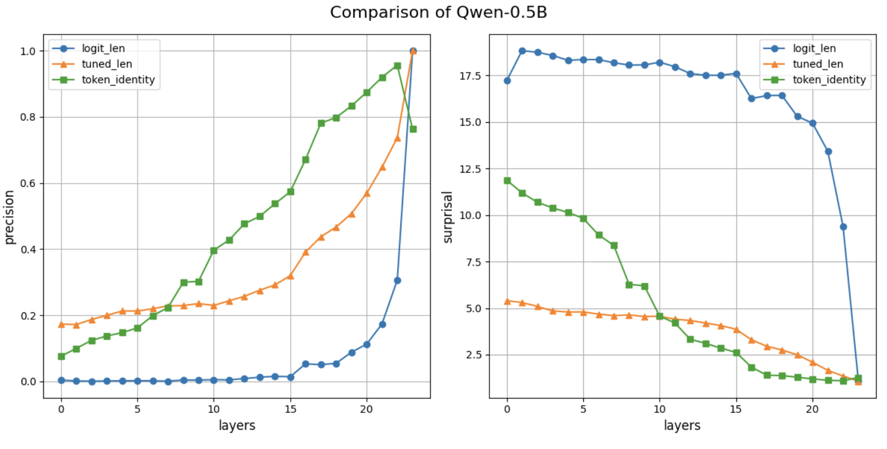
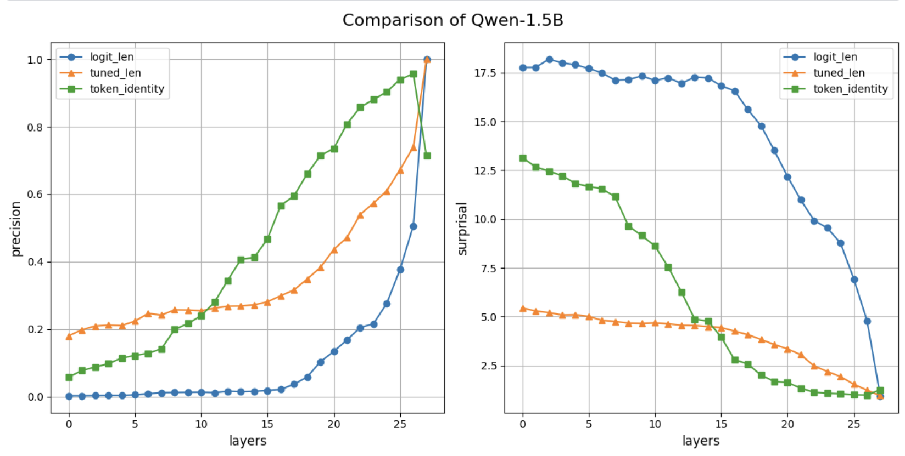

# PatchScope Reimplementation for Qwen Series Model

  
*A framework to decode next token prediction in Qwen using PatchScope*

---

## Overview

This repository contains a reimplementation of the [PatchScope framework](https://arxiv.org/abs/2401.06102) applied to the Qwen series model. Our goal is to uncover how Qwen predicts the next token by probing its intermediate representations. Key findings include precision and surprisal metrics across layers, visualized below.

## Background
Recent advancements in large language models (LLMs) have spurred interest in interpretability techniques to understand their inner workings. In this paper, I reimplement the PatchScope framework, originally proposed by Ghandeharioun et al., 2024, and apply it to the Qwen series model. Our work focuses on decoding the mechanisms behind next token prediction, leveraging PatchScope to probe the model's intermediate representations. We present empirical results, including precision across layers and surprisal metrics over 24 layers, shedding light on the model's predictive behavior. This study contributes to the broader understanding of LLMs and provides a reproducible framework for further exploration.

## introduction
Large language models (LLMs) have achieved remarkable performance across various natural language processing tasks, yet their decision-making processes remain opaque. Understanding how these models predict the next token is a critical step toward interpretability and trustworthiness. The PatchScope framework, introduced by Ghandeharioun et al. (2024), offers a novel approach to dissecting LLMs by patching intermediate representations across layers. In this work, I adapt PatchScope to investigate the Qwen series model, a family of LLMs known for their efficiency and performance.

Our study aims to answer the following questions: (1) How does the Qwen model encode information for next token prediction? (2) What insights can PatchScope reveal about the model's layer-wise behavior? To this end, I reimplement PatchScope and extend its application to Qwen, analyzing precision and surprisal metrics across its architecture. The contributions of this paper are threefold: a faithful reimplementation of PatchScope, its novel application to the Qwen series, and a detailed analysis of predictive dynamics supported by visualizations.


## Main Results
### 1.0 The Decoding of the Next Token Prediction
In this section, I explore how the Qwen series model decodes information to predict the next token, using PatchScope to probe its internal representations.




To quantify the model’s behavior, I measure precision across layers, illustrating how predictive accuracy evolves as information flows through the network. Figure 1 presents these findings:


### 2.0 Extract attribute 


## Conclusion
This repository presents a reimplementation of PatchScope and its application to the Qwen series model, focusing on decoding next token prediction and extract specific attributes. Through precision and surprisal analyses, I uncover layer-wise dynamics that enhance our understanding of Qwen’s behavior. My work is fully reproducible, with code and results in readme.txt. Future directions include extending PatchScope to other LLMs and exploring contextual variations in prediction.


### Features
- Faithful reimplementation of PatchScope
- Application to Qwen series model
- Analysis of next token prediction with visuals

---

## Installation

To get started, clone the repository and install dependencies:

```bash
git clone https://github.com/yourusername/patchscope-qwen.git

More reasonably, I recommend those who are interested in this project to use kaggle or google colab to use the free gpu resources .
